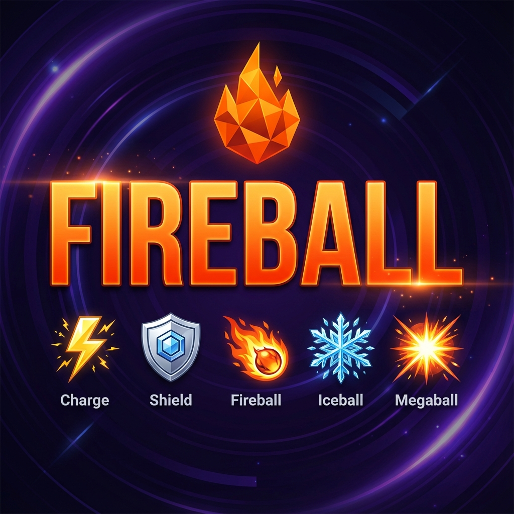

# Fireball

A strategic turn-based battle game powered by machine learning. Challenge an AI trained through Q-learning or compete against other players in real-time online matches.



## Overview

Fireball is a game of prediction and resource management. Players simultaneously choose moves to gain charges, defend, or attack. The core challenge lies in outsmarting your opponent—whether it is a human or a trained machine learning model.

The AI opponent uses a Q-learning algorithm that uses state analysis (tracking move history and charge states) to predict player actions and counter them effectively. As more games are played, the model's training data grows, allowing for continuous improvement.

## Features

-   **Play vs AI**: Battle against a Q-learning model that adapts to game patterns.
-   **Online Multiplayer**: Real-time 1v1 matchmaking system to play against friends or strangers.
-   **Live Stats**: Track unique visitors, AI win rates, and recent match results.
-   **Live Player Tracking**: Real-time counter showing currently active players on the site.
-   **Responsive Design**: A completely custom, modern UI built with vanilla CSS variables and React (no heavy CSS frameworks).

## Game Rules

The goal is to hit your opponent with an attack they fail to block.

**Moves & Costs:**

-   **Charge (+1 Energy)**: Gain energy to perform attacks. You are vulnerable while charging.
-   **Shield (0 Energy)**: Blocks Fireball and Iceball. Does not block Megaball.
-   **Fireball (-1 Energy)**: Defeats an opponent who is Charging. Blocked by Shield. Beaten by Iceball.
-   **Iceball (-2 Energy)**: Defeats an opponent who is Charging or using Fireball. Blocked by Shield.
-   **Megaball (-5 Energy)**: Instantly wins the game (Unblockable). Can only be countered by another Megaball.

## Technology Stack

-   **Frontend**: React 18, Babel (Standalone), custom CSS3 design system.
-   **Backend**: Python 3.12 Serverless Functions (Vercel).
-   **Database**: Google Firebase Firestore (NoSQL) for matchmaking, stats, and game logging.
-   **AI Model**: Custom Python Q-learning implementation (`model.pkl` serialization).

## Local Development

### Prerequisites

-   Python 3.9+
-   Node.js & npm (for Vercel CLI)
-   Firebase Project Credentials

### Installation

1.  Clone the repository:
    ```bash
    git clone https://github.com/Dhruv-1729/fireball.website.git
    cd fireball.website
    ```

2.  Install Vercel CLI:
    ```bash
    npm install -g vercel
    ```

3.  Set up Environment Variables:
    Create a `.env` file or configure Vercel with your Firebase credentials.
    ```
    FIREBASE_SERVICE_ACCOUNT={"type": "service_account", ...}
    ```

4.  Run Locally:
    ```bash
    cd fireball.backend
    vercel dev
    ```

    Or for a simple frontend-only test (without backend API features):
    ```bash
    python3 -m http.server 3000
    ```

## Development Structure

```
fireball.website/
├── fireball.backend/
│   ├── api/                # Python Serverless Functions
│   │   ├── matchmaking.py  # Online 1v1 logic & heartbeat
│   │   ├── play_ai.py      # AI game logic & model handling
│   │   └── stats.py        # Global statistics endpoints
│   ├── index.html          # Main React Application
│   ├── logo.svg            # Vector Logo
│   ├── model.pkl           # Pre-trained Q-Learning Model
│   └── vercel.json         # Deployment Configuration
└── README.md
```

## Deployment

This project is optimized for deployment on **Vercel**.

1.  Push code to GitHub.
2.  Import project into Vercel.
3.  Set the Root Directory to `fireball.backend`.
4.  Add the `FIREBASE_SERVICE_ACCOUNT` environment variable in Vercel settings.
5.  Deploy.

## License

MIT License.
