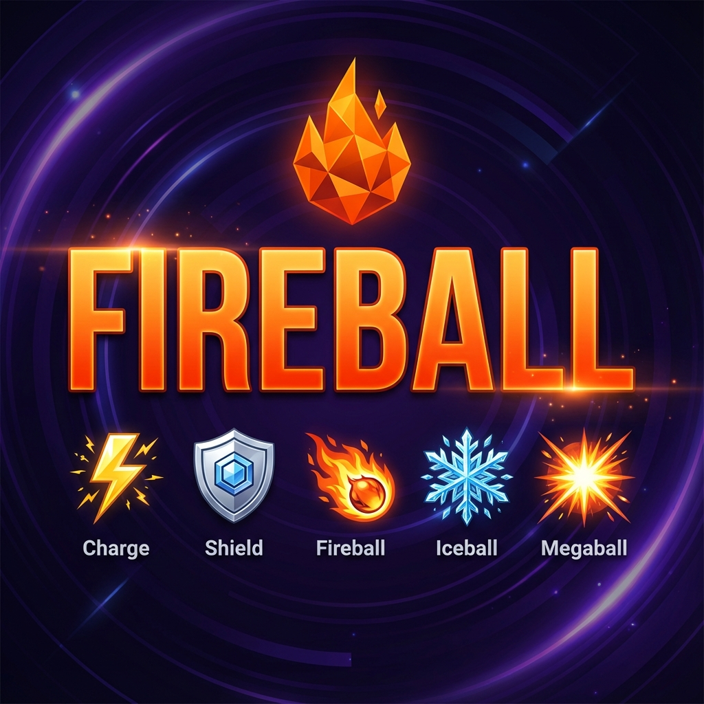

  

  <strong>A turn-based strategy game with a Q-Learning ML Bot.</strong> 
  Charge up, read your opponent, throw fireballs. 
  "It's easy to learn, but hard to master.

  

  
  
  
  

---

## What is Fireball?

Fireball is a turn based game similar to rock paper scissors, but removes the 100% luck aspect of it.

Both players pick a move each turn simultaneously. You need to **charge** energy to attack, but charging leaves you exposed. Shield blocks most attacks. Attacks cost energy. The mind games come from figuring out *when* your opponent is going to commit.

The AI is trained through Q-Learning with eligibility traces and self-play. It picks up on patterns; so if you're predictable, it'll punish you. 

## Moves

| Move | Cost | What it does |
|------|------|-------------|
| ⚡ **Charge** | Free (+1) | Gain 1 energy. You're vulnerable while doing this. |
| 🛡️ **Shield** | Free | Block all attacks except Megaball. |
| 🔥 **Fireball** | 1 energy | Kills a charging opponent. Blocked by Shield, beaten by Iceball. |
| ❄️ **Iceball** | 2 energy | Beats Fireball and Charge. Still blocked by Shield. |
| 💥 **Megaball** | 5 energy | Unblockable instant win. Only countered by another Megaball. |

You *have* to charge to win, but charging is the most dangerous thing you can do.

Everything runs on Vercel serverless functions. Game state lives in Firestore. No WebSocket server — the 1v1 system uses a polling-based approach with Firebase real-time listeners on the client for responsiveness.

## Game Modes

- **vs AI** — Play against the Q-Learning model. Server-side game sessions prevent client-side cheating.
- **1v1 Online** — Real-time matchmaking against other players. Heartbeat system tracks who's online, matches get auto-terminated if someone disconnects.

## License

Do whatever you want with it. If you build something cool on top of it, I'd love to hear about it 😀
